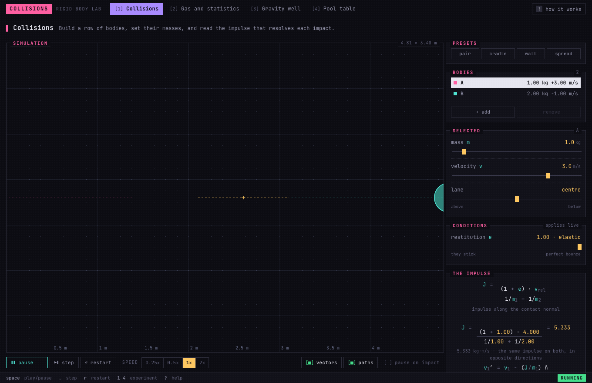
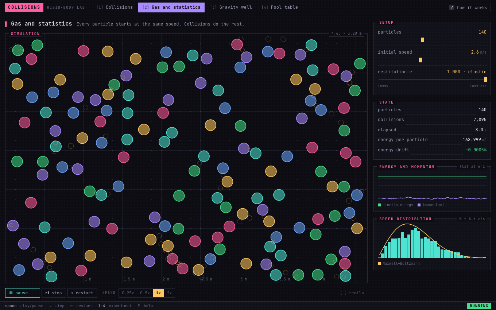
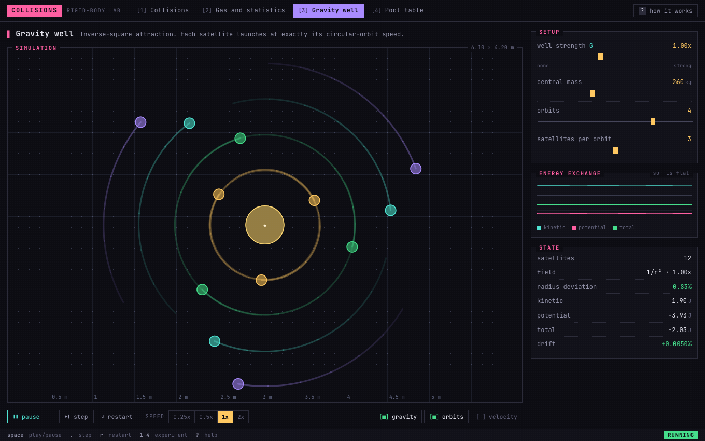

# Collisions

**An interactive rigid-body physics laboratory, in the browser.**

Not an animation of balls bouncing — an instrument, dressed as a terminal. You set the
experiment up with real numbers (kilograms, metres, seconds), launch it, and the impact is
captured with **the impulse equation solved using your own values**.

### → [Open the laboratory](https://gh-jaider.github.io/Collisions-Simulator/)



---

## The four experiments

### 1 · Collisions

Two discs, one impact. You pick the masses, the velocities, how head-on the hit is, and the
coefficient of restitution. At the instant of contact the simulator freezes what happened
and breaks it down:

$$J = \frac{(1 + e)\,v_{\text{rel}}}{1/m_1 + 1/m_2}$$

…and below it, the same formula with your numbers substituted and the result. The
*before and after* panel shows each body's velocity on both sides of the impact and its
change in momentum Δp — which turn out to be equal and opposite, because that is literally
what an impulse means.

Things you can see in thirty seconds:

- At `e = 1` with equal masses, the velocities **swap**.
- At `e = 1`, equal masses, one at rest: they leave at exactly **90°**.
- With a huge `m₂`, the light body bounces back at nearly its own speed.
- Momentum is conserved **always**. Energy only if `e = 1`.

### 2 · Gas and statistics



A couple of hundred particles start out **all at the same speed** — a situation that does
not exist in nature. Purely by colliding with one another, within seconds the distribution
broadens into the Maxwell–Boltzmann curve, drawn over the histogram.

**The curve is not fitted to the histogram.** Its single parameter comes from the mean
square speed, which is fixed by the total energy of the system. It is computed separately
and drawn on top; that the two agree is the result, not the premise.

### 3 · Gravity well



Inverse-square attraction between every pair of bodies, with each satellite launched at
exactly its circular-orbit speed. The plot shows kinetic and potential energy trading back
and forth endlessly while their **sum stays flat**: that exchange *is* the orbit. Inner
shells come round in about a second and outer ones take four, which puts Kepler's third
law on display without saying a word about it.

**Then cut the string.** Switch `gravity` off mid-orbit. Almost everyone expects the
satellites to fly outwards, away from the centre — and they do not. With no force acting,
each one carries straight on along the *tangent* it already had, exactly as Newton's first
law says. The trails show it plainly: an arc, then a hard straight line. The orbit was
never something pushing them out; it was gravity continuously bending a straight line.

The `well strength` slider changes the constant live, so you can wind the well up and watch
the circles spiral inward, or ease it off and watch them drift out.

### 4 · Pool table

The sandbox. Coulomb friction, cloth drag, and restitution below 1. This is the one you
can interfere with: drag a ball and release to throw it, drag empty felt to catapult a new
ball in, right-click to remove one. The dark mark on each ball turns with it — without
that, rolling and sliding look exactly the same.

---

## Why the numbers can be trusted

The engine is completely separate from the display and is verified against results you can
derive by hand. **44 tests**, and these are the ones that matter:

| Check | Result |
|---|---|
| 90 bodies, 220 collisions, 12 s, no walls | momentum drift `3·10⁻¹⁵`, energy drift **exactly 0** |
| 1-D elastic collision, four mass ratios up to 1:1000 | matches the closed form to every digit |
| Glancing blow between equal masses | `90.000000°` |
| The recorded impulse | equals what the formula shown in the panel predicts |
| Orbits after 40 s, at three well strengths | radius stable to within **5%** |
| A satellite after the field is cut | leaves along its tangent to within `0.1%`, at unchanged speed |
| A gas starting at one single speed | coefficient of variation 0.35–0.7 (Rayleigh predicts 0.523) |
| Momentum at `e` = 0, 0.35, 0.8, 1 | conserved in all four cases |

The *energy drift* panel on screen is that same check, live. Potential energy is included
whenever a force field is switched on — a falling ball speeds up because it is converting
potential into kinetic, not because the integrator invented it — and the figure only turns
green when the current settings *should* conserve energy.

### How contacts are resolved

Sequential impulses with accumulated-impulse clamping, the same approach Box2D uses:

- **Restitution is captured once**, from the approach speed, so repeated iterations cannot
  pump energy into the contact.
- **The accumulated normal impulse can never go negative**: a contact pushes, it does not
  pull. That is what stops a pair already flying apart from being dragged back together.
- **Overlap is corrected geometrically**, split by inverse mass, over several passes that
  re-measure the depth each time. Impulses only fix velocities; without this, bodies sink
  into each other and stay there.
- **Substepping adapts to the fastest body**, so nothing tunnels through anything between
  two discrete positions.
- **The broad phase is a uniform spatial hash** that emits each candidate pair exactly
  once, with no deduplication pass.

Immovable bodies carry an inverse mass of exactly zero, not a very large number: they are
exact, not approximate.

---

## Running it

```bash
npm install
npm run dev        # http://localhost:5173
```

```bash
npm test           # 44 tests, ~4 s
npm run build      # to dist/
```

Deployment is automatic: every push to `main` runs the tests and publishes to GitHub Pages
(`.github/workflows/deploy.yml`). If the tests fail, nothing ships.

> To enable it on a fork: **Settings → Pages → Source: GitHub Actions**. If your repository
> has a different name, change `base` in `vite.config.ts`.

The whole site is **18 kB of gzipped JavaScript** with no runtime dependencies.

## About the interface

The visual language is borrowed wholesale from TUIs — Charm's tooling, `sampler`, a
well-made curses app — which turns out to suit an instrument better than a conventional
web layout does. That means a few firm commitments:

- One monospace face for everything, the maths included. A terminal has no second font,
  and the even rhythm is most of what makes the look.
- Every box is a one-pixel rule with its title cut into the top border, the way a
  box-drawing character set renders `┌─ TITLE ─────┐`.
- Square corners, flat fills, no shadows and no gradients. A cell either has a colour or
  it does not — which is also why the bodies are drawn as flat discs with a bright rim
  rather than shaded spheres.
- Selection is inverse video, never a soft glow.

No ASCII art, though: the simulation is drawn with real geometry at full resolution. The
aesthetic is the chrome, not the physics.

## Using the physics on its own

The engine knows nothing about canvases, the DOM, or display units:

```ts
import { Body, Vec2, World, defaultParameters } from "./src/physics";

const world = new World(8, 5, defaultParameters({ restitution: 1, walls: false }));
world.add(new Body({ position: new Vec2(2, 2.5), velocity: new Vec2(3, 0), mass: 1 }));
world.add(new Body({ position: new Vec2(5, 2.5), mass: 3 }));

for (let i = 0; i < 600; i++) world.step(1 / 120);

console.log(world.totalMomentum, world.kineticEnergy);
console.log(world.log[0]);   // the impact record: normal, impulse, before and after
```

## Layout

```
src/
  physics/     the engine. No DOM, no canvas, no pixels
    vec.ts       immutable 2-D vectors
    body.ts      rigid discs and their mass properties
    spatial.ts   uniform spatial hash (broad phase)
    world.ts     integration, contacts, energy, and the collision log
  render/      canvas drawing: graticule, lit spheres, vectors
  labs/        the four experiments
  ui/          panels, charts, equations, number formatting
tests/         physics against known answers; labs against what they claim
```

## Licence

MIT.
